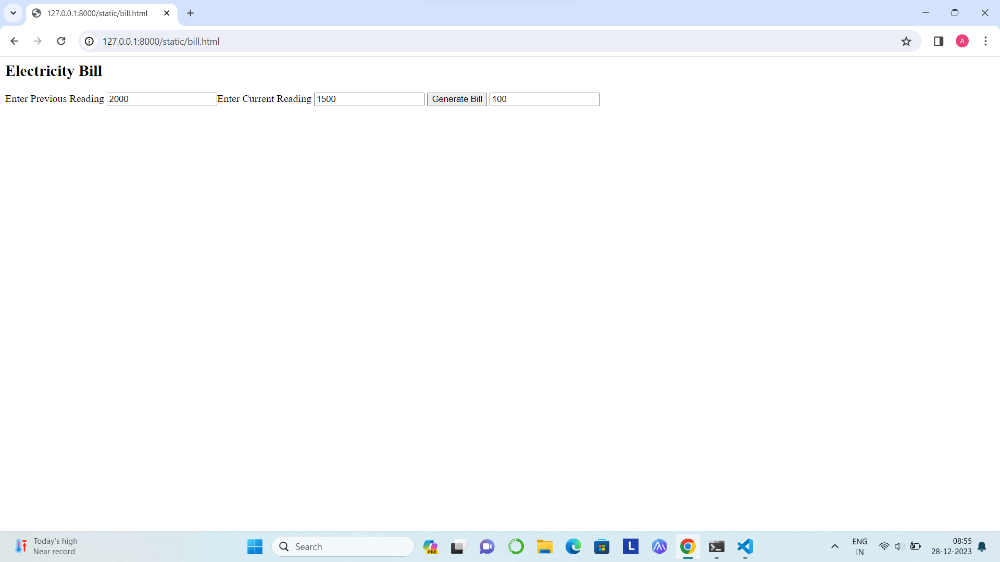
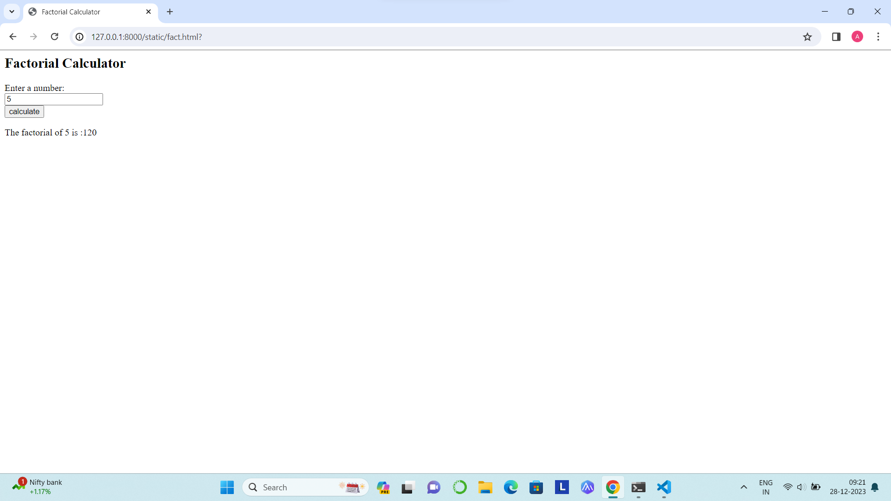
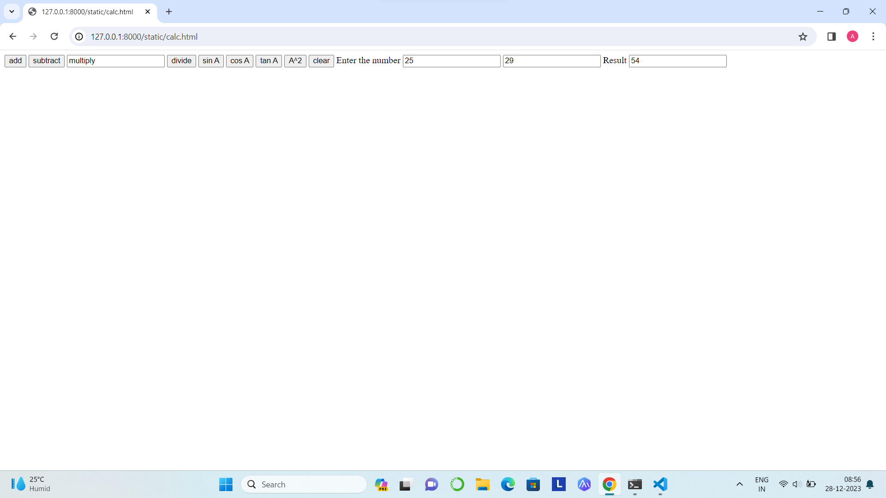
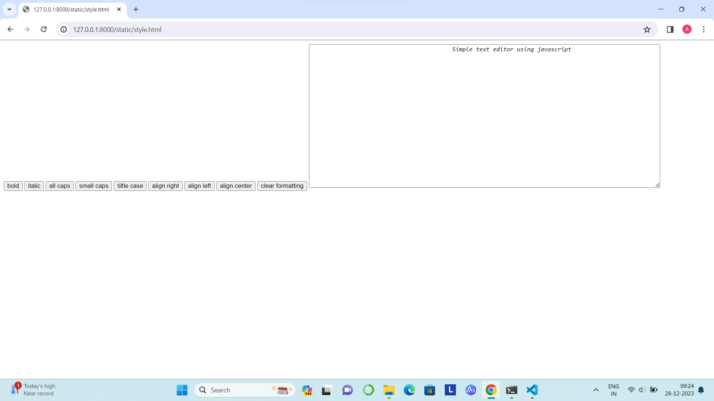
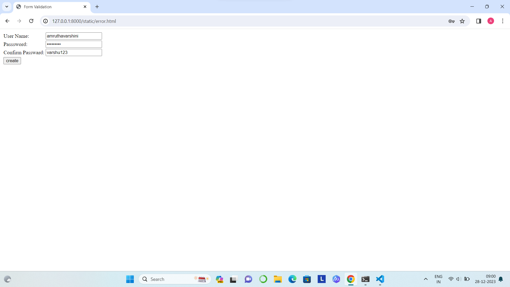

# ODD23-24-WT-JavaScript

Name: Amruthavarshini Gopal

RegisterNumber: 23000851

Department: AIDS

# Ex-09(a)

# AIM:

Create a form with java script code to calculate electricity bill.

# DESIGN STEPS: 9(a)

## Step 1:

Input Units Consumed: Prompt the user to enter the number of units consumed. This can be done using a Scanner object in Java.

## Step 2:

Set Rate Per Unit: Define a variable for the rate per unit of electricity. This will be a constant value
that you can set according to the electricity rates in your area.

## Step 3:

Calculate Bill: Multiply the number of units consumed by the rate per unit to calculate the total bill.

## Step 4:

Display Bill: Print the calculated bill to the console.

# CODE: 
```
<html>
    <head>
        <script type="text/javascript">
            function bill()
            {
                var prev,curr,units,amt;
                prev=Number(document.getElementById("t1").value);
                curr=Number(document.getElementById("t2").value);
                units=curr-prev;
                if(units<=100)
                amt=100;
                else if(units>100&&units<=300)
                amt=100+(units-100)*3;
                else
                amt=100+600+(units-300)*5;
            document.getElementById("t3").value=amt;    
            }
        </script>
    </head>
    <body>
        <h2>Electricity Bill</h2>
        <form>
            Enter Previous Reading
            <input type="text" id="t1">Enter Current Reading
            <input type="text" id="t2">
            <input type="button" onclick="bill()" value="Generate Bill">
            <input type="text" id="t3">   
        </form>
    </body>
</html>
```
# OUTPUT:




# Ex-09(b)

# AIM:

Develop a JavaScript program to compute the factorial of a given number without recursion.

# DESIGN STEPS: 

## Step 1:

Initialize a variable result to 1. This will hold the final factorial value.

## Step 2:

Start a loop from 2 to the given number n.

## Step 3:

In each iteration of the loop, multiply the current number i with result and update result.

## Step 4:

After the loop ends, result will hold the factorial of n. Return result.

# CODE:
```
<html>
    <head>
        <title>Factorial Calculator</title>
    </head>
    <body>
        <h2>Factorial Calculator</h2>
        <form id="factorial form">
            <label for="number">Enter a number:</label><br>
            <input type="number" id="number" name="number"><br>
            <input type="button" value="calculate" onclick="fact()">
        </form>
        <p id="result"></p>

        <script>
            function fact()
            {
                var num=document.getElementById("number").value;
                var factorial=1;
                for(var i=1;i<=num;i++){
                    factorial=factorial*i
                }
                document.getElementById("result").innerHTML="The factorial of " +num+ " is :"+ factorial;
            }
        </script>
    </body>
</html>
```
# OUTPUT:



# Ex-09(c)

# AIM:

Construct a JavaScript code to generate ‘N’ prime numbers.

# DESIGN STEPS: 9(c)

## Step 1:

Initialize a count variable to keep track of the number of prime numbers generated.

## Step 2:

Start from the number 2 (the first prime number), and for each number, check if it is prime.

## Step 3:

If the number is prime, increment the count and print the number.

## Step 4:

Repeat steps 2 and 3 until ‘N’ prime numbers have been generated.

# CODE: 
```
<html>
    <head>
        <script type="text/javascript">
            function prime()
            {
                var low=Number(document.getElementById("n1").value);
                var high=Number(document.getElementById("n2").value);
                var i,j;
                for(i=low;i<=high;i++)
                {
                    var digi=0;
                    for(j=2;j<i;j++)
                    {
                        if(i%j==0)
                        {
                            digi=1;
                            break;
                        }
                    }
                    if(digi==0&&i>1)
                    alert(i);
                }
            }
        </script>
    </head>
    <body>
        <form>
            Enter starting value
            <input type="text" id="n1">
            Enter ending value
            <input type="text" id="n2">
            Inbetween prime numbers are
            <input type="button" onclick="prime()" value="Generate">
        </form>
    </body>
</html>
```
# OUTPUT:


# Ex-09(d)

# AIM:

Construct a JavaScript program to implement a simple calculator.

# DESIGN STEPS: 

## Step 1:

Define a function for each operation (addition, subtraction, multiplication, division) that takes two
numbers as input and returns the result of the operation.

## Step 2:

Define a function calculate that takes three parameters: two numbers and an operator. This function
will call the appropriate operation function based on the operator provided.

## Step 3:

Call the calculate function with the numbers and operator as arguments to perform a calculation.

## Step 4:

Print the result of the calculation.

# CODE: 
```
<html>
    <head>
        <script type="text/javascript">
            function f1()
            {
                var a=Number(document.getElementById("n1").value);
                var b=Number(document.getElementById("n2").value);
                document.getElementById("n3").value=a+b;
            }
            function f2()
            {
             var a=Number(document.getElementById("n1").value);
             var b=Number(document.getElementById("n2").value);
             document.getElementById("n3").value=a-b;   
            }
            function f3()
            {
                var a=Number(document.getElementById("n1").value);
                var b=Number(document.getElementById("n2").value);
                document.getElementById("n3").value=a*b;
            }
            function f4()
            {
                var a=Number(document.getElementById("n1").value);
                var b=Number(document.getElementById("n2").value);
                document.getElementById("n3").value=a/b;
            }
            function f5()
            {
                var a=Number(document.getElementById("n1").value);
                var b=Number(document.getElementById("n2").value);
                document.getElementById("n3").value=Math.sin(a);
            }
            function f6()
            {
                var a=Number(document.getElementById("n1").value);
                var b=Number(document.getElementById("n2").value);
                document.getElementById("n3").value=Math.cos(a);
            }
            function f7()
            {
                var a=Number(document.getElementById("n1").value);
                var b=Number(document.getElementById("n2").value);
                document.getElementById("n3").value=Math.tan(a);
            }
            function f8()
            {
                var a=Number(document.getElementById("n1").value);
                var b=Number(document.getElementById("n2").value);
                document.getElementById("n3").value=a*a;
            }
            function f9()
            {
                document.getElementById("n1").value=" ";
                document.getElementById("n2").value=" ";
                document.getElementById("n3").value=" ";
            }
        </script>
    </head>
    <body>
        <form>
            <input type="button" onclick="f1()" value="add">
            <input type="button" onclick="f2()" value="subtract">
            <input typr="button" onclick="f3()" value="multiply">
            <input type="button" onclick="f4()" value="divide">
            <input type="button" onclick="f5()" value="sin A">
            <input type="button" onclick="f6()" value="cos A">
            <input type="button" onclick="f7()" value="tan A">
            <input type="button" onclick="f8()" value="A^2">
            <input type="button" onclick="f9()" value="clear">
            Enter the number
            <input type="text" id="n1">
            <input type="text" id="n2">
            Result
            <input type="text" id="n3">
              
        </form>
    </body>
</html>
```
# OUTPUT:



# Ex-09(e)

# AIM:

Design a simple text editor JavaScript application where we can manipulate the user input in
different styles, edit the input, capitalize, and many string operations.

# DESIGN STEPS: 

## Step 1:

User enters the text in the text area.

## Step 2:

User clicks on one of the buttons to perform an operation (capitalize, lowercase, reverse).

## Step 3:

The JavaScript function corresponding to the operation is executed. This function gets the text from
the text area, performs the operation, and updates the result paragraph with the new text.

## Step 4:

The result is displayed on the webpage. The user can perform more operations or enter new text.
The process repeats from Step 2.

# CODE:
```
<html>
    <head>
        <script type="text/javascript">
            function f1()
            {
                document.getElementById("num").style.fontWeight="bold";
            }
            function f2()
            {
                document.getElementById("num").style.fontStyle="italic";
            }
            function f3()
            {
                document.getElementById("num").style.textTransform="upper case";
            }
            function f4()
            {
                document.getElementById("num").style.textTransform="lower case";
            }
            function f5()
            {
                document.getElementById("num").style.textTransform="capitalize";
            }
            function f6()
            {
                document.getElementById("num").style.textAlign="right";
            }
            function f7()
            {
                document.getElementById("num").style.textAlign="left"
            }
            function f8()
            {
                document.getElementById("num").style.textAlign="center";
            }
            function f9()
            {
                document.getElementById("num").style.fontWeight="normal";
            }
        </script>
    </head>
    <body>
        <form>
            <input type="button" onclick="f1()" value="bold">
            <input type="button" onclick="f2()" value="italic">
            <input type="button" onclick="f3()" value="all caps">
            <input type="button" onclick="f4()" value="small caps">
            <input type="button" onclick="f5()" value="tiltle case">
            <input type="button" onclick="f6()" value="align right">
            <input type="button" onclick="f7()" value="align left">
            <input type="button" onclick="f8()" value="align center">
            <input type="button" onclick="f9()" value="clear formatting">
            <textarea rows="20" cols="100" id="num">
                Simple text editor using javascript
            </textarea>
        </form>
    </body>
</html>
```
# OUTPUT:




# Ex-09(f)

# AIM:

Design a JavaScript program which displays error messages when a field in form is entered
incorrectly.

# DESIGN STEPS: 

## Step 1:

User fills out the form and clicks the “Submit” button.

## Step 2:

The validateForm function is executed. This function gets the values of the name and email fields.

## Step 3:

The function checks if the name and email fields are filled out and if the email is a valid email
address. If a field is entered incorrectly, it sets the corresponding error message.

## Step 4:

The function updates the corresponding error message spans with the error messages. If a field is
entered incorrectly, the error message is displayed on the webpage. The user can correct the errors
and submit the form again. The process repeats from Step 2.

# CODE:
```
<html>
    <head>
        <title>Form Validation</title>
        <script type="text/javascript">
            var divs=new Array();
            divs[0]="errUserName";
            divs[1]="errPassword";
            divs[2]="errConfirm";
            function validate()
            {
                var inputs=new Array();
                inputs[0]=document.getElementById('username').value;
                inputs[1]=document.getElementById('password').value;
                inputs[2]=document.getElementById('confirm').value;
                var errors=new Array();
                errors[0]="<span style='color:red'>Please enter your Username!</span>";
                errors[1]="<span style='color:red'>Please enter your password!</span>";
                errors[2]="<span style='color:red'>Please confirm your password!</span>";
                for(i in inputs)
                {
                  var errMessage=errors[i];
                  var div=divs[i];
                  if(inputs[i] == "")
                         document.getElementById(div).innerHTML=errMessage;
                  else if(i==1)
                  {
                    var first=document.getElementById('password').value;
                    var second=document.getElementById('confirm').value;
                    if(second!=first)
                        document.getElementById('errConfirm').innerHTML="<span style='color:red'>Your passwords don't match!</span>";
                    else
                        document.getElementById(div).innerHTML="OK!"; 
                  }
                    else
                           document.getElementById(div).innerHTML="OK!";
                }
            }
                    function finalValidate()
                    {
                      var count=0
                      for(i=0;i<2;i++)
                      {
                        var div=divs[i];
                        if(document.getElementById(div).innerHTML=="OK!")
                        count=count+1;
                      }
                      if(count==2)
                            document.getElementById("errFinal").innerHTML="All the data you entered is correct!!!";

                    }

        </script>
    </head>
    <body>
        <table id="table1">
            <tr>
                <td>User Name:</td>
                <td><input type="text" id="first" onkeyup="validate();"/></td>
                <td><div id="errUserName"></div> </td>
            </tr>
            <tr>
                <td>Passsword:</td>
                <td><input type="password" id="password" onkeyup="validate();"/></td>
                <td><div id="errPassward"></div></td>
            </tr>
            <tr>
                <td>Confirm Passward:</td>
                <td><input type="passward" id="confirm" onkeyup="validate();"/></td>
                <td><div id="errConfirm"></div></td>
            </tr>
            <tr>
                <td><input type="button" id="create" value="create" onclick="validate();finalValidate();"></td>
                <td><div id="errFinal"></div></td>
            </tr>
        </table>
    </body>
</html>
```
# OUTPUT:



# RESULT:

All the javacript codes was executed successfully.

